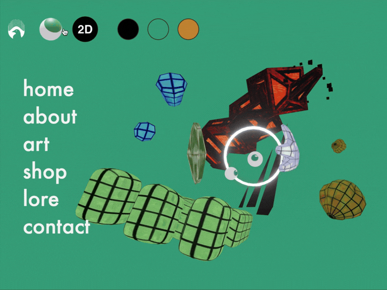
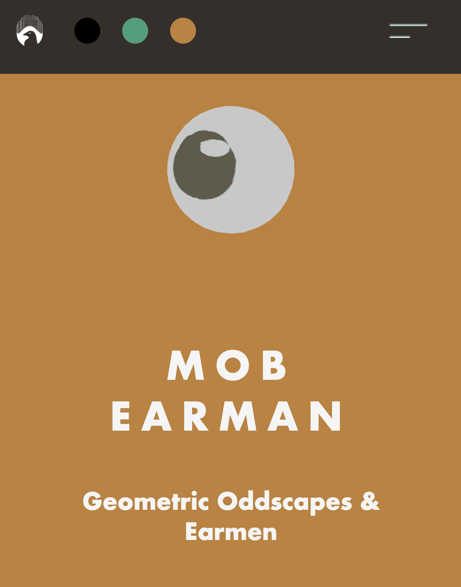
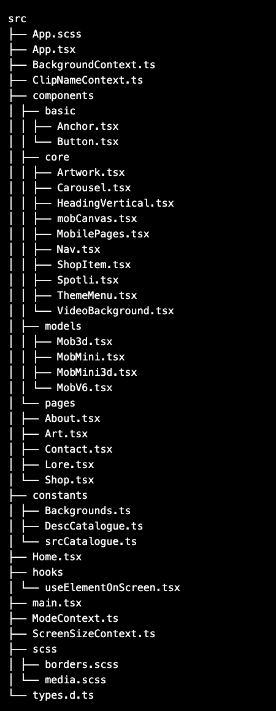

# Mob Earman Artist Website

A fun, interactive art website for artist Mob Earman, written with React 3 fibre, React, SCSS, and Typescript. The site includes multiple color modes, two 3d models created in blender and configured to run in R3f, and a different DOM structure to accommodate small and large screens.

## Usage

### Usage from User POV

The aim was to create as much interactivity as possible for a simple 'earman' model. So, I created multiple 'skin' buttons to change the textures on the 3d models along with the page modes.

Considering this is a browser render of a 3d canvas, there is a 2d option to allow a similar feel, but without the heavy duty rendering.

In mobile, the page is laid out for ease of scrolling with conditional rendering & intersection observer keeping unseen parts hidden or unmounted. The web layout is more of a one-page layout conditionally rendering from menu buttons

### Navigating as a Developer

- The page is split into multiple modules as per a react way of developing.

- The 3d models have been processed via the programme gltfjsx to convert them into components. Each was also compressed with the transform flag to free up space, and the config splits the chunk output to attempt to lower cpu load also.

- Most styling is completed through SCSS and the BEM method, with the exception of conditional rendering relying on state within the home page.

- The main strucure is split into two - rendering above screen width 820px and below. Once reaching 820, the former pages dismount and a stacked version of them with a different 3d model (MobMini) takes their place.

- srcCatalogue and descCatalogue are a front-end storage solution for the large amount of media sources that would cloud the already complex enough tree in Home or components such as Artwork. When adding media or changing media, the sources and info should be added there first with alts and info accordingly. This will dynamically update if you're modifying a current component, or will be available as an object via import.

- The UseElementOnScreen hook is the intersection observer, used for the fade ins on mobile.

- The contexts are Background, ClipName, ScreenSize and Mode:

#### Background

    Background passes the standard colours across the tree to make sure react modules can access them when changing modes

#### ClipName

    Currently only containing two values, this signals to the 2d model MobV6 which amimation action should be playing. The options are Idle and Checkout, the latter triggering at the push of the eye logo top left in the nav.

#### Screensize

    Speaks for itself; allows for conditional rendering rather than simply hiding content, mainly to deal with background loading of the 3d models.

#### Mode

    This is the most important and defines what the current page mode is. Similar to dark mode in a standard set up, there's a few options, but each changes the skin of the model, background video animations and sometimes the entire web-look.

## Roadmap

In the future, since the components are now standardised enough to build known features quickly, I would love to implement e2e testing to ensure nothing breaks when adding new features and components run consistently with their predecessors.

I ran out of time when it came to rendering 3d models, optimising & chunk splitting. I have a feeling importing all as THREE is an overkill fix to a typing issue within the 3d tsx components, which I think may slow performance.

That said, I’d love to add more actions to the actions array for the web version of the model and create clearer signage on how to trigger such actions.

Lastly, since this is one point in a triangle of linked creative projects, I would like to add easter eggs that lead to the other sites or provide the keys to unlock secrets in the more game-like world of Snoozecrow, yet to be built fully.

## Contributing

This site is closed for contribution as it is a specific website built for a specific artist.

## Authors and acknowledgment

This is a project created entirely by Snoozecrow Studio.

## License

All rights reserved.

You may not copy or modify any part of the website, including the source code, images, audio, or other assets, distribute its files, or use the code or assets in your own projects

## Project status

Mob Earman is a brand new project and I expect to be making updates to this website at least monthly.
